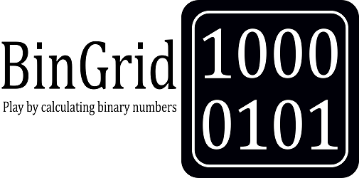
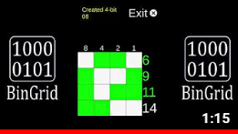
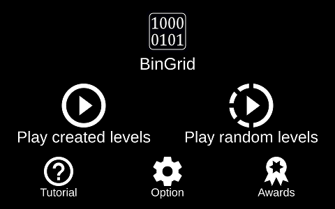
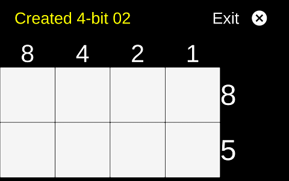
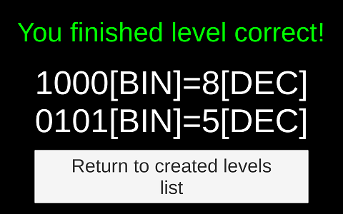
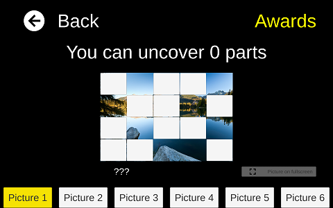

# BinGrid

A puzzle game in which you convert a decimal number to a binary number. After completing the level, you can collect the reward by revealing a part of the picture.

You can play this game on your Android device: https://play.google.com/store/apps/details?id=com.BlommGames.BinGrid&hl=pl

## Game trailer

BinGrid Trailer: https://www.youtube.com/watch?v=wN5lsbpe0cs&ab_channel=Bart%C5%82omiejGrywalski

## Screenshots

### 1. Main Menu

### 2. Game level - befor start play

### 3. Game level - after finish

### 4. Award menu
